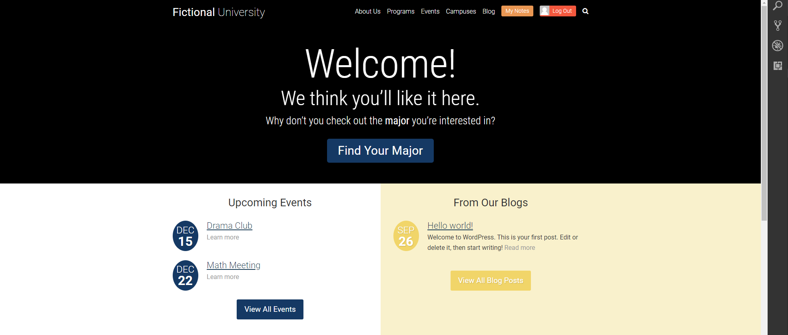
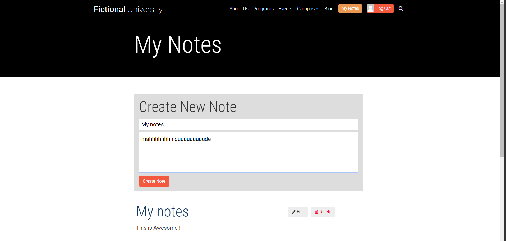
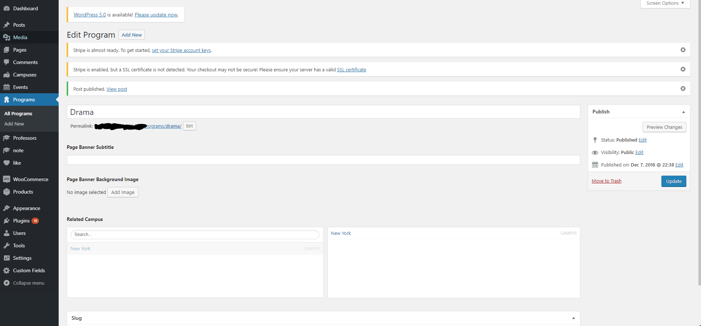

# NOT MY CODE
# The best wordpress tutorial ive done.
# by Brad Schiff
A wordpress tutorial i did which pretty much covers everything you need to know to be a wordpress developer, could'nt recommend this enough go to check it out https://www.udemy.com/become-a-wordpress-developer-php-javascript DO IT !

Covers
- The loop
- Post Types 
- meta key values etc...
- Action and filters, hooks 
- WP_query
- Custom Posts
- ACF
- REST API !!!!
- CRUD
- Post Status Transitions (awesome)
- google maps
- Jquery

# Screenshots

# Home Page

# My notes with custom REST API 

# Backend

